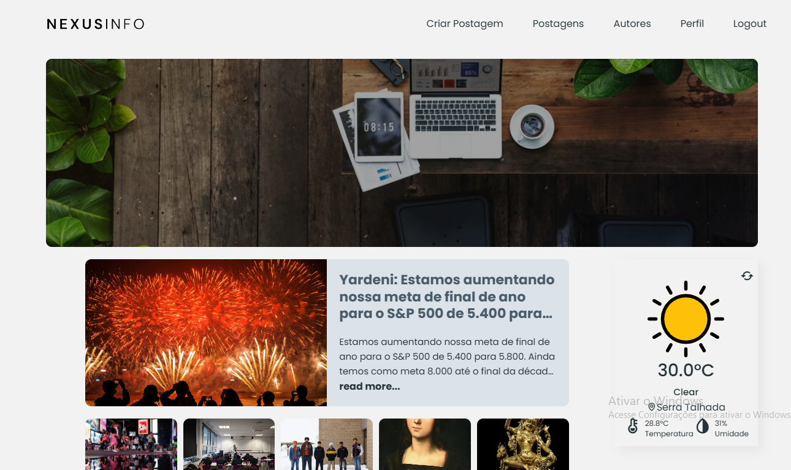

# 📚 NexusInfo - Blog App  

O **NexusInfo-BlogApp** é um site desenvolvido em **React JS** que permite aos usuários criar, compartilhar e gerenciar seus blogs de maneira simples e eficiente. Utilizando tecnologias modernas da web, o aplicativo oferece uma interface intuitiva tanto para blogueiros quanto para leitores. Além disso, o **NexusInfo** salva localmente os posts no navegador utilizando **localStorage**, garantindo o acesso a rascunhos mesmo quando offline.  

## Deploy

- [Live](https://react-blog-v1.vercel.app/)

## 🌟 Funcionalidades  

- **Criação e edição de blogs**: Interface simples para escrever e editar postagens.  
- **Compartilhamento**: Permite que os blogs sejam compartilhados com outros usuários.  
- **Gerenciamento de conteúdo**: Organização e navegação intuitiva entre as postagens.  
- **Funcionalidade offline**: Postagens são salvas localmente com **localStorage**.  
- **Design amigável e responsivo**: Interface adaptada para diversos dispositivos.  

## 📸 Capturas de Tela  

### Página Inicial  
  

*(Adicione mais capturas de tela conforme necessário para mostrar outras funcionalidades ou telas do aplicativo.)*  

## 🛠 Tecnologias Utilizadas  

- **React JS**: Framework JavaScript para construção de interfaces de usuário.  
- **CSS3**: Para estilização do aplicativo.  
- **localStorage**: Para salvar dados localmente no navegador.  

## 📦 Configuração do Projeto  

### Pré-requisitos  
Certifique-se de ter instalado:  
- [Node.js](https://nodejs.org/) (versão 16 ou superior).  
- [npm](https://www.npmjs.com/) ou [yarn](https://yarnpkg.com/).  

## 📜 Licença  

Este projeto está licenciado sob a licença MIT. Consulte o arquivo [LICENSE](LICENSE) para mais detalhes. 
